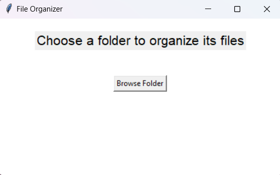

# File Organizer

A simple Python-based file organizer that categorizes and organizes your files into designated folders based on their extensions. It allows users to easily sort files such as images, documents, videos, audio, archives, scripts, and more with a simple GUI interface.

## Features

- **Drag-and-drop or folder selection**: Easily select the folder you want to organize.
- **File categorization**: Automatically sorts files based on their extension into predefined categories (Images, Documents, Videos, Audio, Archives, Scripts, and Applications).
- **GUI interface**: Uses `Tkinter` to provide an easy-to-use interface for the user.
- **Progress indication**: Displays a progress window while files are being organized.
- **Customization**: Can be expanded to add more file types and categories.



## Supported File Categories

The following file categories are supported and will be sorted into their respective folders:

- **Images & Graphics**: `.jpg`, `.jpeg`, `.png`, `.gif`, `.bmp`, `.tiff`, `.svg`, `.ico`, `.webp`
- **Documents & Text Files**: `.pdf`, `.docx`, `.doc`, `.txt`, `.rtf`, `.odt`, `.xlsx`, `.xls`, `.csv`, `.pptx`, `.ppt`, `.md`
- **Audio & Music**: `.mp3`, `.aac`, `.wav`, `.flac`, `.ogg`, `.m4a`, `.wma`, `.aiff`
- **Videos & Movies**: `.mp4`, `.mkv`, `.mov`, `.avi`, `.flv`, `.wmv`, `.webm`, `.mpeg`
- **Code & Scripts**: `.py`, `.js`, `.sh`, `.html`, `.css`, `.java`, `.cpp`, `.c`, `.cs`, `.ipynb`, `.php`, `.go`, `.rb`, `.swift`, `.rs`, `.ts`, `.kt`
- **Compressed Archives**: `.zip`, `.rar`, `.7z`, `.tar`, `.gz`, `.bz2`, `.xz`, `.iso`
- **Applications & Executables**: `.exe`, `.apk`, `.dmg`, `.app`, `.deb`, `.bin`, `.msi`, `.bat`
- **eBooks & Reading**: `.epub`, `.mobi`, `.azw3`, `.fb2`, `.ibooks`, `.djvu`
- **CAD & Design Files**: `.dwg`, `.dxf`, `.skp`, `.3ds`, `.obj`, `.blend`, `.stl`
- **Fonts & Typography**: `.ttf`, `.otf`, `.woff`, `.woff2`, `.eot`
- **Spreadsheets & Data**: `.xls`, `.xlsx`, `.csv`, `.ods`
- **Presentations**: `.ppt`, `.pptx`, `.key`
- **Database Files**: `.sql`, `.db`, `.sqlite`, `.mdb`, `.accdb`
- **Project Files**: `.psd`, `.ai`, `.indd`, `.xd`, `.fla`, `.sketch`, `.fig`
- **Torrents & Downloads**: `.torrent`, `.crdownload`, `.part`, `.tmp`
- **Web Files**: `.html`, `.htm`, `.css`, `.js`, `.php`, `.xml`, `.json`
- **Miscellaneous**: `.log`, `.bak`, `.old`, `.cfg`, `.ini`

## Installation

### Prerequisites

Ensure you have Python installed on your machine. This project uses the following libraries:

- Tkinter (for GUI)
- shutil (for file manipulation)
- os (for system operations)
- logging (for error and activity logging)

Install dependencies with:

```bash
pip install -r requirements.txt
